# CS 109 A Final project
## Group #8, Naval Goel and Vinay Nihalani
## Lending Club
### Project Background

Lending club is a peer-to-peer platform that matches people looking to borrow with people willing to lend. 

### Objective

Our goal remains to build a strategy that will enable an investor to select and build a portfolio of loan notes, say 5 to 10, that maximizes the rate of return of the portfolio given a risk profile of the investor.

### Project Outline
1.	Extract, and visualize data on loan notes. Do a preliminary analysis to understand which variables seem to be dependent. 
2.	Clean data as necessary 
3.	Determine a methodology to accurately calculate a rate of return on individual loan notes based on loan amount, loan status, interest rate, service charges etc.
4.	Group data by loan grade and calculate loan data statistics.  
5.	Compare results with rate of returns advertised by the site and explain potential reasons why results may be different.
6.	Determine optimal number of significant predictor variables and split data into training set, tuning and testing set.
7.	Model the data using Multiple Linear Regression, Polynomial Regression, Ridge Regression, Lasso Regression, KNN Model, Neural Networks and an Ensemble model
8.	Calculate test dataset scores from all models.
9.	Compare predicted rate of return against true rate of return
10.	Summarize results.
11.	Conclusions and Future Work

### Description of the Data
We located a file name “LoanStats3a.csv” on the lending club website and imported the data to ipython notebook. We found that there are 42,539 observations and 164 columns. The Lending Club website listed that the data was from 2007 to 2011. 
The data for loan applications from individuals.  The loan amount requested ranged from $ 500 to $ 35,000 for two terms: 36 months and 60 months.  The borrowings were at different interest rates from a low of 5.4% to 24.6% depending on the risk profile of the borrower, here called note grade. Most of the loans requested are for the purpose of personal use: credit cards payment, car purchase, home improvement, medical bills, vacation, wedding etc. And there are about 2,000 applications for small business and renewal energy purposes. One interesting observation in the dataset is that there are about 15 individuals listing annual income of over $ 1 million but requesting loans for less than $ 25,000. 

**Data Cleaning**
Here are the steps we have taken so far to clean up the data:
1.	First we reviewed all 164 columns of data from which would have to identify response variable or variables and predictor variables.  We looked for those columns that had no data and removed them from the dataset. With this cleaning, we were left with 64 columns of data.  A list of the column removed is given in Appendix A containing the ipython notebook.
2.	Second, we went through each of the 64 columns and reviewed columns with majority of the data missing.  We found nine columns with more than 90% of data missing, except for one with about 63% data missing. We dropped these columns also and were left with 55 variables: either predictor or response variables.
3.	We also dropped those observations which did not have any values for some of the columns. Out of a total of 42,539 loan applications in the data set, we were left with 41,084 observations.
4.	Then, we looked at the correlation between these variables and found significant correlations between several variables. The correlation matrix is shown below.
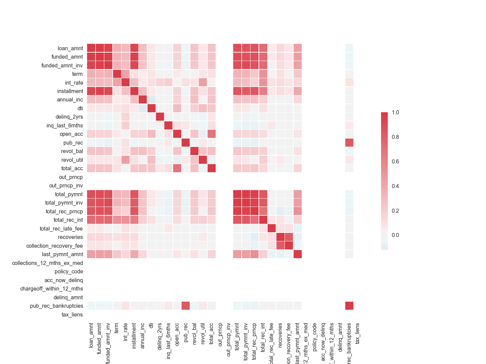     
5.	Next, we reviewed our strategy to come up with a response variable.  We decided to evaluate an investor’s rate of return on the amount funded for the loan.                                               
    a.  To calculate the return, we calculated the total net amount investor received from this investment.  We calculate the total net payment received as follows:
    
    b.  The amount invested was given as amount committed to the loan: 
    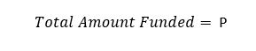      
    c.	The duration for this loan was calculated using the month when loan was funded and the month when the last payment was received.
    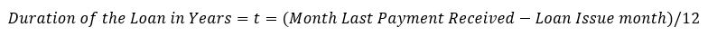   
    d.  With this information, we had the calculations for the response variable: rate of return.
    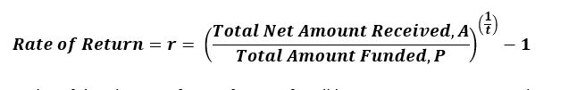
Below is a plot of distribution of rate of return for all loans, 42,452. As we see, there are several loans where an investor lost all of the funding amount                                                    
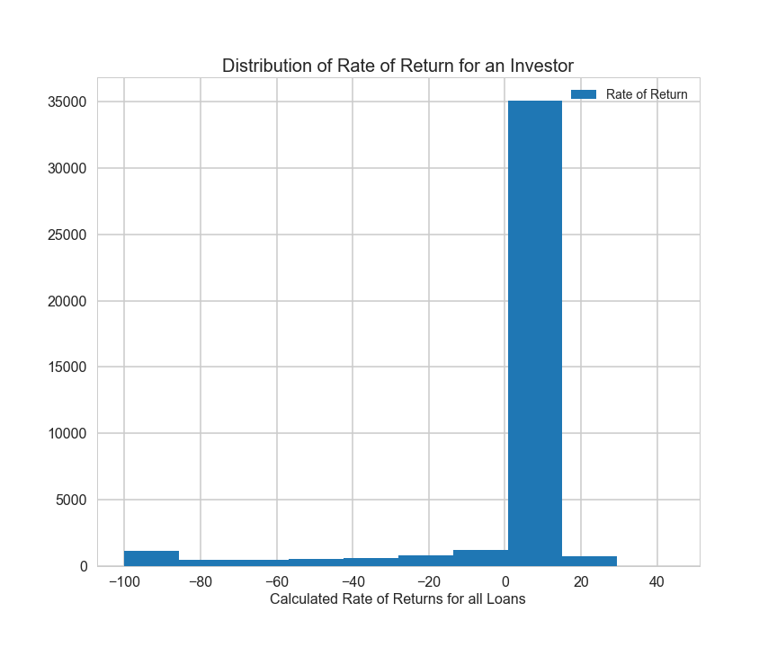      
6.	We plotted calculated rate of return against the Grade assigned to the loan and found the trend similar to what is posted on Lending Club website. That is the rate of return increases as the Loan grade increases from “A” to “G” as shown below. Also shown is the plot from the lending club website. One thing different our plot and that of the lending club is that we show negative returns but the website does not show negative return.  We know there are several borrowers who did not repay their loans so the data shown in the chart at the website is missing data of the delinquent borrowers.
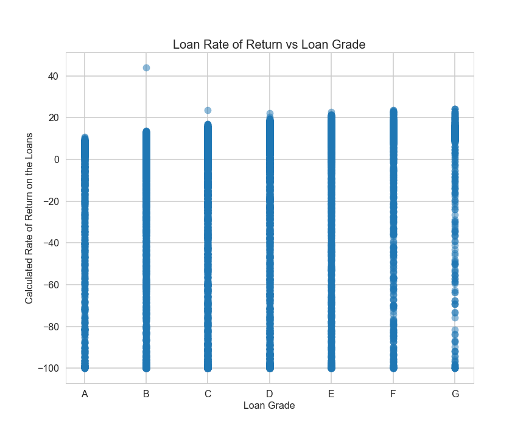
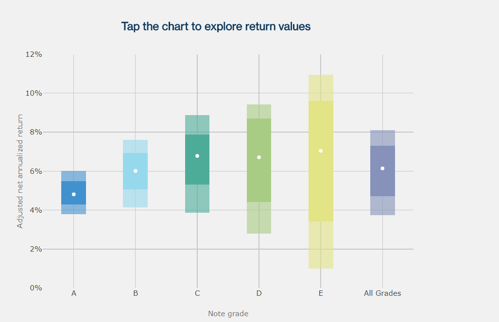

### Data Modeling
Based on the correlation matrix and our definition of the response variables, we reviewed the variables in the data.  We decided on some variables as not relevant to our analysis. These included identification of borrower’s state, zip code and other columns that were descriptive, neither categorical nor numerical features.              
We then reviewed data of predictor variables with only one value left. For example, the loans were issued to “individuals” only, with no “delinquencies” or no “collections in last 12 months” or no “charge-offs within 12 months” or no “tax liens”, and funding payment made with “cash”, and applications having “publicly available policy code”.                  
We hot coded some of the categorical variables. With these efforts, we were left with a total of 19 predictor variables: categorical and quantitative.                    
Based on all data, we ran a baseline model to get a feel of the data and found the R2 score to be 0.017. Below is a plot of predicted rate of returns versus true returns as a function of loan grade. As expected for a low score model, the predicted values capture the true data but does not predict the whole range of returns.
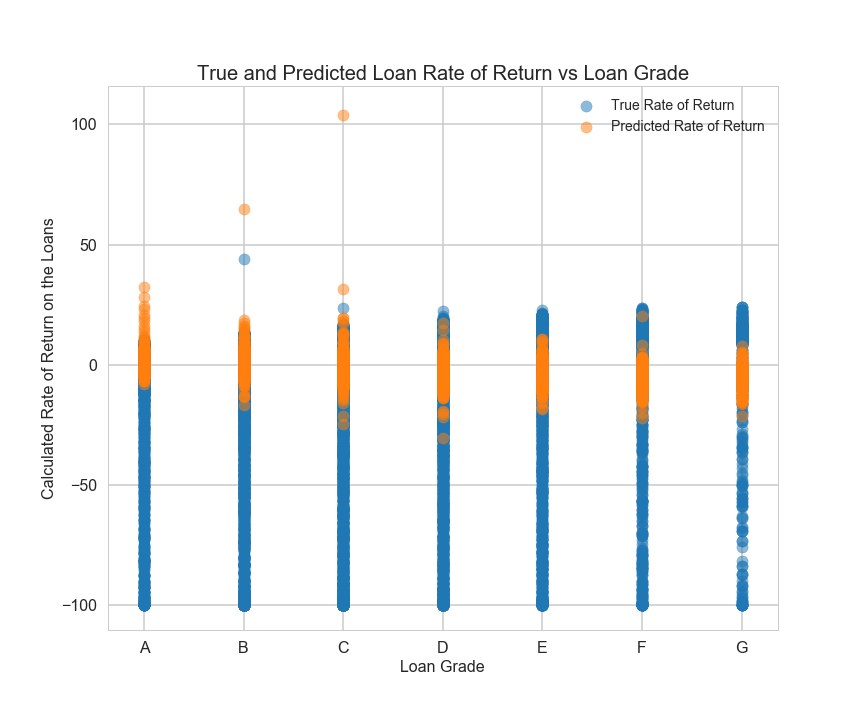

Then, we split 41,030 observations into training dataset (56%), tuning dataset (24%) and the rest into test datasets. We then ran training dataset through multiple models and calculated regression score on the training and test dataset. The models we ran were:

-   Multiple Linear Regression
-   2nd Order Polynomial Regression
-   3rd Order Polynomial Regression
-   Ridge Linear Regression with cross-validation for regularization parameter 
-   Lasso Linear Regression with cross-validation for regularization parameter 
-   2nd Order Polynomial Ridge Regression with cross-validation for regularization parameter
-   2nd Order Polynomial Lasso Regression with cross-validation for regularization parameter
-   KNN Model with cross-validation for number of neighbors
-   Neural Network
-   Ensemble Model on the Linear Regression Models

### Results Summary

Below is a summary of the R2 scores from each of these models:

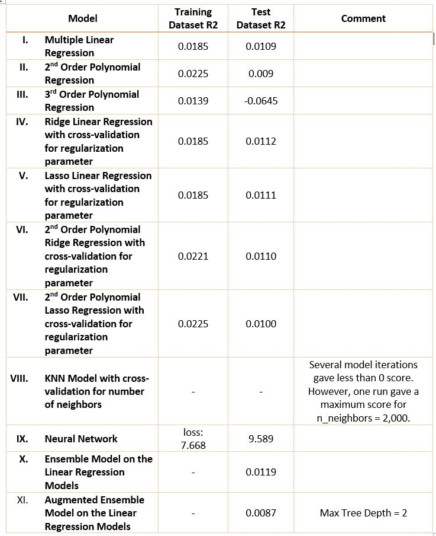

Below plot shows comparison of true rate of returns for the test dataset against linear model and 2nd order polynomial model predictions:

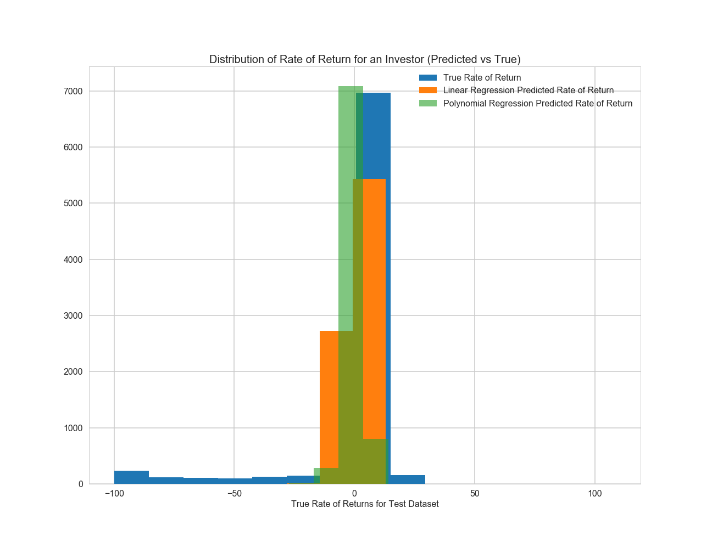

Here is the statistical summary of the test data response variable:
- True response variable summary:
  - nobs=8182, 
  - minmax= (-100.0, 43.909039857023501), 
  - mean=0.049527210985669763, 
  - variance=518.52405955295558, 
  - skewness=-3.2256815615995436, 
  - kurtosis=9.683449314980685
  
- Linear Regression predicted response variable summary:
  - nobs=8182, 
  - minmax= (-28.075227494938652, 108.73777856006748), 
  - mean= 0.088435166051528194,
  - variance= 10.686902031568248,
  - skewness=3.6555570909714596, 
  - kurtosis=152.07682995153087
 
- 2nd Order Polynomial Regression predicted response variable summary:
  - nobs=8182, 
  - minmax= (-27.264683288833567, 75.995858611072052),  
  - mean= 0.079186165215684265, 
  - variance= 11.764743373173422, 
  - skewness=0.446800882473385, 
  - kurtosis=31.807910428345323

### Recommended Portfolio to Invest

As listed in our objective, we would like to recommend a portfolio of 10 loans that an investor can invest.  Below is a list of the ten highest predicted rate-of-returns.  
The ten highest predicted rate-of-returns using the linear model predicted rate of returns are:

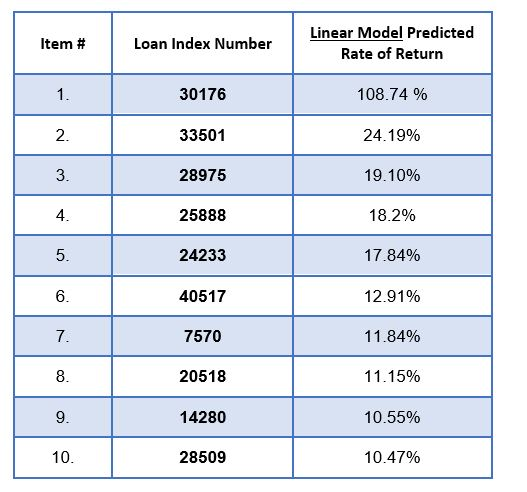

The ten highest predicted rate-of-returns using the 2nd order polynomial regression model are:

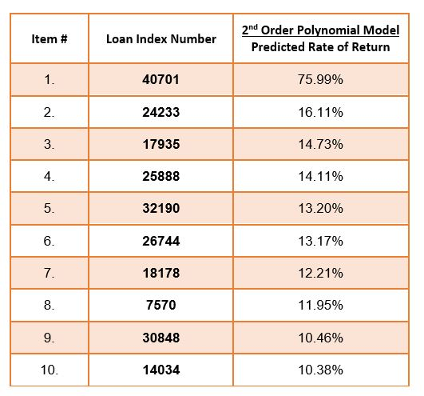

### Future Work

The models developed in the project exhibit very low R2 scores.  This is because it is difficult to correlate the response variable: rate of return with the predictor variables listed in the loans dataset available on the company website.  We would like to visit with the Lending Club and discuss our modeling results and seek opportunities for further modeling efforts. 

The distribution chart above shows that the rate of return data is skewed to the left. Also, the rate of return dataset contains negative values due to complete loss of invested capital if the loan borrower failed to return the funded amount. We researched literature to figure out a way to get a better normal distribution of a long tail dataset containing negative values.  The suggestions included transforming the data by taking square of the variable or making a linear transformation of the dataset. We tried these two transformations however it did not improve our accuracy score.
We also hope to take CS-109B in Spring 2019 and understand what other tools are available for dataset that is skewed to the left. 
