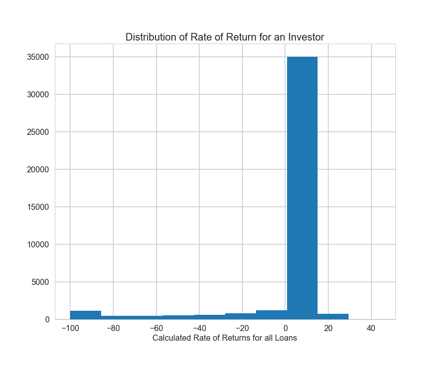

# CS 109 A Final project
## Group #8, Naval Goel and Vinay Nihalani
### Lending Club
### Project Background

Lending club is a peer-to-peer platform that matches people looking to borrow with people willing to lend. 

### Objective

Our goal remains to build a strategy that will enable an investor to select and build a portfolio of loan notes, say 5 to 10, that maximizes the rate of return of the portfolio given a risk profile of the investor.

### Project Outline
1.	Extract, and visualize data on loan notes. Do a preliminary analysis to understand which variables seem to be dependent. 
2.	Clean data as necessary 
3.	Determine a methodology to accurately calculate a rate of return on individual loan notes based on loan amount, loan status, interest rate, service charges etc.
4.	Group data by loan grade and calculate loan data statistics.  
5.	Compare results with rate of returns advertised by the site and explain potential reasons why results may be different.
6.	Determine optimal number of significant predictor variables and split data into training set, tuning and testing set.
7.	Model the data using Multiple Linear Regression, Polynomial Regression, Ridge Regression, Lasso Regression, KNN Model, Neural Networks and an Ensemble model
8.	Calculate test dataset scores from all models.
9.	Compare predicted rate of return against true rate of return
10.	Summarize results.
11.	Conclusions and Future Work

### Description of the Data
We located a file name “LoanStats3a.csv” on the lending club website and imported the data to ipython notebook. We found that there are 42,539 observations and 164 columns. The Lending Club website listed that the data was from 2007 to 2011. 
The data for loan applications from individuals.  The loan amount requested ranged from $ 500 to $ 35,000 for two terms: 36 months and 60 months.  The borrowings were at different interest rates from a low of 5.4% to 24.6% depending on the risk profile of the borrower, here called note grade. Most of the loans requested are for the purpose of personal use: credit cards payment, car purchase, home improvement, medical bills, vacation, wedding etc. And there are about 2,000 applications for small business and renewal energy purposes. One interesting observation in the dataset is that there are about 15 individuals listing annual income of over $ 1 million but requesting loans for less than $ 25,000. 
Data Cleaning Here are the steps we have taken so far to clean up the data:
1.	First we reviewed all 164 columns of data from which would have to identify response variable or variables and predictor variables.  We looked for those columns that had no data and removed them from the dataset. With this cleaning, we were left with 64 columns of data.  A list of the column removed is given in Appendix A containing the ipython notebook.
2.	Second, we went through each of the 64 columns and reviewed columns with majority of the data missing.  We found nine columns with more than 90% of data missing, except for one with about 63% data missing. We dropped these columns also and were left with 55 variables: either predictor or response variables.
3.	We also dropped about observations which did not have any values for some of the columns. Out of a total of 42,539 loan applications in the data set, we were left with 41,084 observations.
4.	Then, we looked at the correlation between these variables and found significant correlations between several variables. The correlation matrix is shown below.

5.	Next, we reviewed our strategy to come up with a response variable.  We decided to evaluate an investor’s rate of return on the amount funded for the loan.

    a.  To calculate the return, we calculated the total net amount investor received from this investment.  We calculate the total net payment received as follows:
 
    b.  The amount invested was given as amount committed to the loan: 
 
    c.	The duration for this loan was calculated using the month when loan was funded and the month when the last payment was received.
    
    d.  With this information, we had the calculations for the response variable: rate of return.
 
Below is a plot of distribution of rate of return for all loans, 42,452. As we see, there are several loans where an investor lost all of the funding amount

